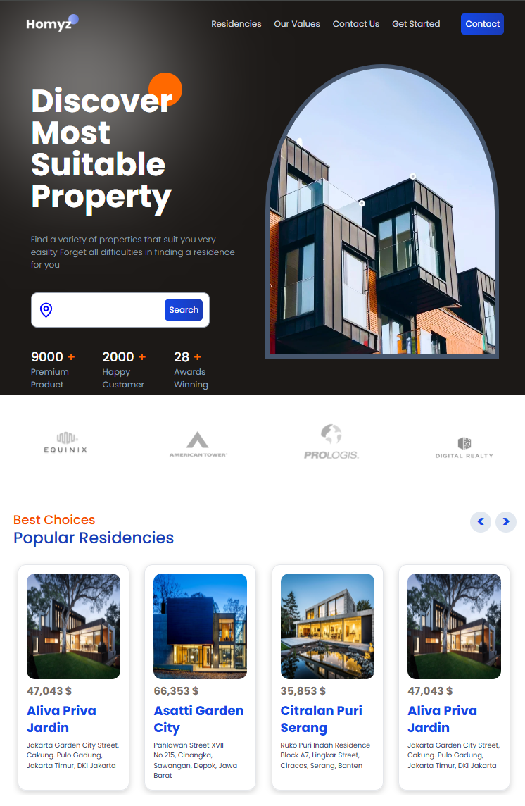

# A Responsive Landing Page for Real Estate Using React + Tailwind  

---

  

Designing a Landing Page With the Newest Technologies for Real Estate Company to Showcase Their Services...and Deploy it to Vercel.

I followed a tutorial by **@ZAINKEEPSCODE** on YouTube:  
  

During the project, I used:  
- **[Lucide Icons](https://lucide.dev/guide/packages/lucide-react)** for the icons.  
- [**Tailwind CSS**](https://tailwindcss.com/docs/installation/using-vite)  for responsive design, leveraging its utility classes to make the page fully responsive.
- **[Framer Motion](https://motion.dev/docs/react-quick-start)** for Animation especially while scrolling on the page.
- **[HeroUI](https://www.heroui.com/)** for some UI Components

This was a great learning experience, Special thanks to **@ZAINKEEPSCODE** for the beautiful tutorial!  

---

### Follow Me:  

- **HackerRank**:   
- **CodePen**:   

---
